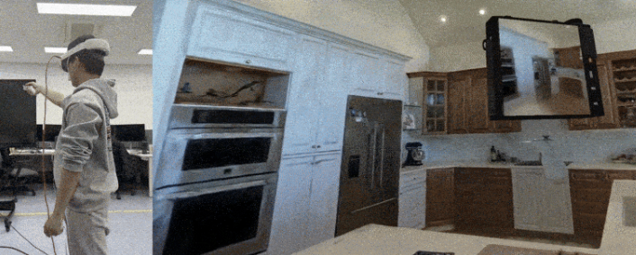

<!-- ===================== -->
<!--  GitHub Profile README -->
<!-- ===================== -->

<h1 align="center">👋 Hi, I'm Seokhyun Cho</h1>

    Interested in VR / AR / XR / Human Computer Interaction  

  <!-- View CV -->
  
  
  <!-- Download CV -->
  

---

## 🎓 Education
- **B.S. in Computer Science and Engineering**  
  Konkuk University (KU), Seoul, Korea                           March 2020 – Aug 2026                          

---

## 🛠 Skills

### Programming Languages
- C / C++
- Python
- C#

### Game & XR
- Unity (XR Interaction Toolkit)
- Meta Quest 3
- Blender(Basic)
- Unreal(Basic)

### Tools & Environments
- Git / GitHub
- Visual Studio / VS Code
- Linux (Ubuntu)
- Conda / vcpkg / CMake

---

## 📌 Featured Projects

  
  

  <a href="https://github.com/seokhyun0303/Photorealistic-VR-Tour-with-3D-Gaussian-Splatting"><b>Photorealistic VR Tour (3DGS)</b></a>
  &nbsp;•&nbsp;
  <a href="https://github.com/seokhyun0303/VR-DRUM"><b>VR DRUM</b></a>

---

## 📊 GitHub Stats

  

---

## 📫 Contact
- Email: seokhyuncho0303@gmail.com
- GitHub: https://github.com/seokhyun0303

